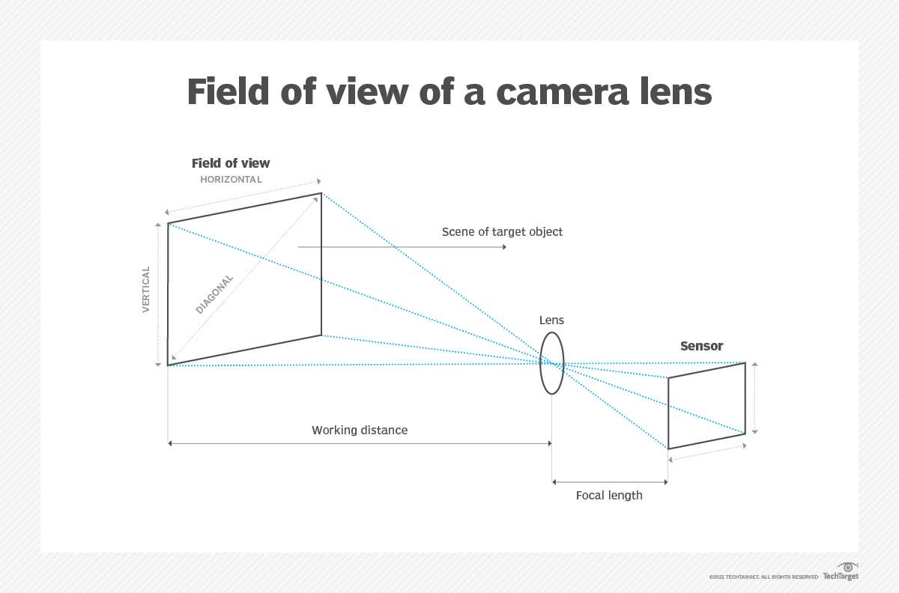

# Machine-Vision-Infomation
The source code contains information and techniques about machine vision such as DoF, VoF, ...
## Field of View (FoV)

[LENS CALCULATOR FOR STANDARD LENSES](https://www.get-cameras.com/Lenscalculator)