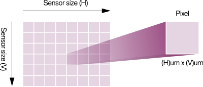
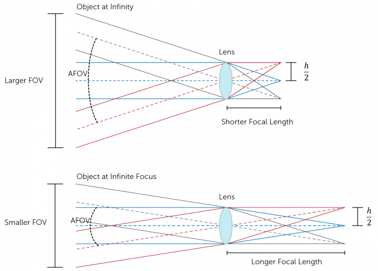

# Machine-Vision-Infomation
The source code contains information and techniques about machine vision such as DoF, VoF, ...

## [Pixel Size Physical](https://www.princetoninstruments.com/learn/camera-fundamentals/pixel-size-and-camera-resolution)

A pixel is the part of a sensor which ***collects photons*** so they can be converted into photoelectrons. Multiple pixels cover the surface of the sensor so that both the number of photons detected, and the location of these photons can be determined.

Pixels come in many different sizes, each having their advantages and disadvantages. Larger pixels are able to collect more photons, due to their increase in surface area. This allows more photons to be converted into photoelectrons, increasing the sensitivity of the sensor. However, this is at the cost of resolution.

Smaller pixels are able to provide higher spatial resolution but capture less photons per pixel. To try and overcome this, sensors can be back-illuminated to maximize the amount of light being captured and converted by each pixel.  

The size of the pixel also determines the overall size of the sensor. For example, a sensor which has 1024 x 1024 pixels, each with a 169 μm2 surface area, results in a sensor size of 13.3 x 13.3 mm. Yet, a sensor with the same number of pixels, now with a 42.25 μm2 surface area, results in a sensor size of 6.7 x 6.7 mm.

## [Camera Resolution](https://www.princetoninstruments.com/learn/camera-fundamentals/pixel-size-and-camera-resolution)
Camera resolution is the ability of the imaging device to ***resolve two point that are close together***. The higher the resolution, the smaller the detail that can be resolved from an object. It is influenced by pixel size, magnification, camera optics and the Nyquist limit. Camera resolution can be determined by the equation:
$$ 
Camera r Resolution = \frac{Pixel Size}{Magnification} * 2.3
$$
Where 2.3 compensates for the ***Nyquist limit***. This limit is determined by the Rayleigh Criterion of the sample.

## [Lens Resolution](https://www.princetoninstruments.com/learn/camera-fundamentals/pixel-size-and-camera-resolution)
It is also important to consider the resolution of the camera lens when determining the overall system resolution. The ability for a lens to resolve an object is limited by diffraction. When the light emitted from an object travels through a lens aperture it diffracts, forming a diffraction pattern in the image (as shown in Figure 3A). This is known as an Airy pattern, and has a central spot surrounded by bright rings with darker regions in-between (Figure 3B). The central bright spot is called an Airy disk, of which the angular radius is given by:

$$
θ = 1.22 * \frac{λ}{D}
$$
Where θ is the angular resolution (radians), λ is the wavelength of light (m), and D is the diameter of the lens (m).

## [Field of View (FoV)](https://www.princetoninstruments.com/learn/camera-fundamentals/field-of-view-and-angular-field-of-view)

***Field of view (FOV)*** is the maximum area of a sample that a camera can image. It is related to two things, the focal length of the lens and the sensor size.

* ***The sensor size*** is determined by both the number of pixels on the sensor, and the size of the pixels. Different sized pixels are used for different applications, with larger pixels used for higher sensitivity, and smaller pixels used for higher spatial resolution.
* ***The focal length of the lens*** describes the distance between the lens and the focused image on the sensor. As light passes through the lens it will either converge (positive focal length) or diverge (negative focal length), however within cameras the focal length is predominately positive. Shorter focal lengths converge the light more strongly (i.e. at a sharper angle) to focus the subject being imaged. Longer focal lengths, in comparison, converge the light less strongly (i.e. at a shallower angle) in order to focus the image.

## Reference
[LENS CALCULATOR FOR STANDARD LENSES](https://www.get-cameras.com/Lenscalculator)